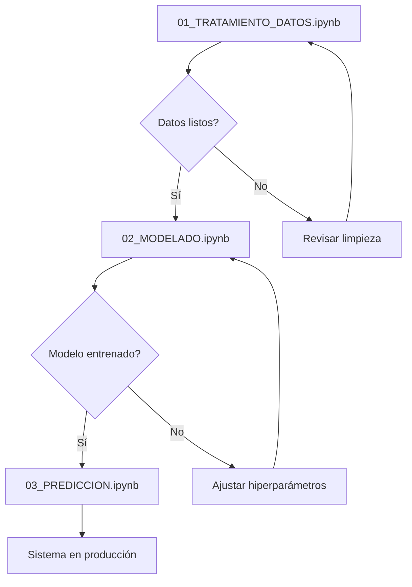

# ✅ LIMPIEZA COMPLETADA - Proyecto Reestructurado

## 🧹 Acciones Realizadas

### 1️⃣ Archivos Eliminados
- ✅ **tempo_data/** - Archivos TEMPO descargados (se recrearán al ejecutar)
- ✅ **modelos_exportados/** - Modelos antiguos
- ✅ **\*.nc** - Archivos NetCDF residuales
- ✅ **\*.h5** - Modelos Keras antiguos
- ✅ **\*.pkl** - Archivos pickle temporales

### 2️⃣ Archivos Reorganizados
- 📦 **TEMPO_PREDICTOR_CLEAN.ipynb** → **TEMPO_PREDICTOR_BACKUP.ipynb** (respaldo)
- ✨ **01_TRATAMIENTO_DATOS.ipynb** → Nuevo notebook estructurado (PRINCIPAL)

### 3️⃣ Documentación Creada
- 📄 **PROYECTO_ESTRUCTURA.md** - Guía completa del proyecto
- 📋 **RESUMEN_LIMPIEZA.md** - Este archivo

---

## 📁 Estructura Actual del Proyecto

```
HACKATON_NASA/
│
├── 📘 01_TRATAMIENTO_DATOS.ipynb      ⭐ COMENZAR AQUÍ
│   └── Notebook principal paso a paso
│       • Configuración
│       • Obtención de datos (OpenAQ + TEMPO)
│       • Limpieza y validación
│       • Análisis exploratorio
│       • Exportación
│
├── 📗 PROYECTO_ESTRUCTURA.md          📖 Guía completa
├── 📕 RESUMEN_LIMPIEZA.md             Este archivo
│
├── 🗂️ TEMPO_PREDICTOR_BACKUP.ipynb    Versión anterior (respaldo)
├── 🧪 PRUEBAS.ipynb                   Experimentos
│
├── ⚙️ config_ejemplo.py               Plantilla de configuración
├── 📦 requirements.txt                Dependencias
├── 📄 README.md                       Documentación general
├── 📄 README_TEMPO.md                 Documentación NASA TEMPO
│
└── 🔧 prediccion_cli.py               Script CLI (legacy)
```

---

## 🎯 Nuevo Enfoque: Paso a Paso

### Fase 1: Tratamiento de Datos (ACTUAL) ✅
**Notebook:** `01_TRATAMIENTO_DATOS.ipynb`

**Contenido:**
1. ✅ Configuración inicial y credenciales
2. ⏳ Cliente OpenAQ (por implementar)
3. ⏳ Cliente TEMPO (por implementar)
4. ⏳ Integración meteorológica
5. ⏳ Fusión de datos
6. ⏳ Limpieza automática
7. ⏳ Análisis exploratorio
8. ⏳ Exportación de datos limpios

**Estado:** Estructura creada, listo para desarrollo

---

### Fase 2: Modelado (PRÓXIMO)
**Notebook:** `02_MODELADO.ipynb` (pendiente de crear)

**Contenido planeado:**
- Preparación de secuencias temporales
- Diseño de arquitectura LSTM
- Entrenamiento del modelo
- Validación y evaluación
- Exportación del modelo

---

### Fase 3: Predicción (FUTURO)
**Notebook:** `03_PREDICCION.ipynb` (pendiente de crear)

**Contenido planeado:**
- Sistema de predicción en tiempo real
- Visualizaciones interactivas
- Reportes automatizados
- API de predicción

---

## 🚀 Cómo Continuar

### Opción 1: Desarrollo Paso a Paso (RECOMENDADO)

1. **Abrir** `01_TRATAMIENTO_DATOS.ipynb`
2. **Ejecutar** las celdas de configuración
3. **Desarrollar** cada sección progresivamente:
   - Cliente OpenAQ
   - Cliente TEMPO
   - Fusión de datos
   - Limpieza
   - Análisis

### Opción 2: Recuperar Trabajo Anterior

Si necesitas código específico del backup:
1. Abrir `TEMPO_PREDICTOR_BACKUP.ipynb`
2. Copiar las clases/funciones necesarias
3. Integrarlas en `01_TRATAMIENTO_DATOS.ipynb`
4. Adaptar al nuevo enfoque modular

---

## 📊 Ventajas del Nuevo Enfoque

### ✅ Organización
- Separación clara de fases
- Código modular y reutilizable
- Fácil de entender y mantener

### ✅ Desarrollo
- Trabajo incremental
- Testing por fases
- Debugging más sencillo

### ✅ Colaboración
- Fácil de compartir
- Documentación clara
- Reproducibilidad

### ✅ Escalabilidad
- Agregar nuevas fuentes de datos
- Experimentar con diferentes modelos
- Implementar mejoras independientes

---

## 🔄 Flujo de Trabajo Sugerido



---

## 📝 Próximas Tareas

### Inmediatas (Fase 1)
- [ ] Implementar cliente OpenAQ
- [ ] Implementar cliente TEMPO
- [ ] Desarrollar fusión de datos
- [ ] Crear pipeline de limpieza
- [ ] Generar visualizaciones exploratorias

### Corto Plazo (Fase 2)
- [ ] Crear `02_MODELADO.ipynb`
- [ ] Preparar secuencias LSTM
- [ ] Diseñar arquitectura
- [ ] Entrenar modelo
- [ ] Evaluar rendimiento

### Mediano Plazo (Fase 3)
- [ ] Crear `03_PREDICCION.ipynb`
- [ ] Sistema en tiempo real
- [ ] Dashboard interactivo
- [ ] API REST
- [ ] Despliegue

---

## 💡 Recomendaciones

1. **Trabajar incrementalmente**
   - Completa una sección antes de pasar a la siguiente
   - Prueba cada componente independientemente
   - Documenta mientras desarrollas

2. **Mantener el respaldo**
   - `TEMPO_PREDICTOR_BACKUP.ipynb` contiene código funcional
   - Úsalo como referencia cuando necesites
   - No lo elimines hasta tener todo migrado

3. **Versionar cambios**
   - Commit frecuente con Git
   - Mensajes descriptivos
   - Ramas para experimentos

4. **Documentar decisiones**
   - Por qué elegiste cierta aproximación
   - Limitaciones encontradas
   - Mejoras futuras

---

## 🎓 Recursos

### Documentación de APIs
- **NASA Earthdata:** https://urs.earthdata.nasa.gov/documentation
- **OpenAQ API:** https://docs.openaq.org/
- **NASA POWER:** https://power.larc.nasa.gov/docs/

### Tutoriales
- **TEMPO Data:** Ver `README_TEMPO.md`
- **Time Series con LSTM:** TensorFlow tutorials
- **Predicción de calidad del aire:** Kaggle kernels

---

## ✨ Estado Final

```
🧹 Limpieza: COMPLETADA
📁 Reorganización: COMPLETADA
📖 Documentación: COMPLETADA
🔧 Configuración: LISTA
🚀 Listo para desarrollar: SÍ
```

---

**¡Ahora puedes comenzar con `01_TRATAMIENTO_DATOS.ipynb` con una estructura limpia y organizada!** 🎉

**Siguiente paso:** Desarrollar el cliente OpenAQ paso a paso.
